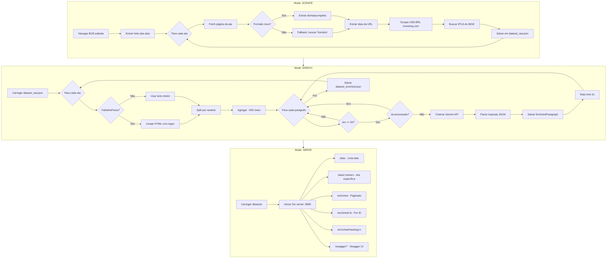
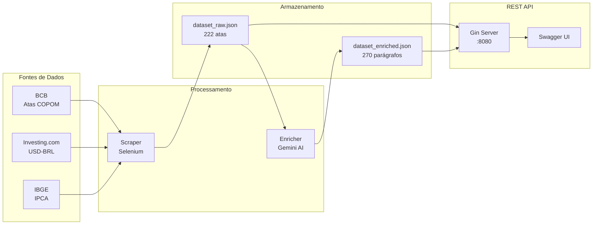
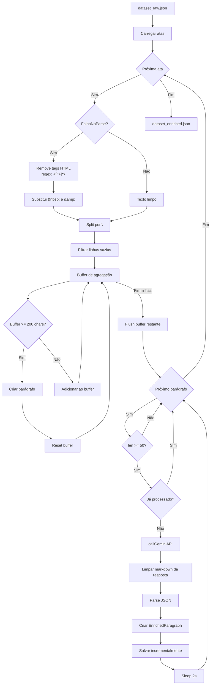
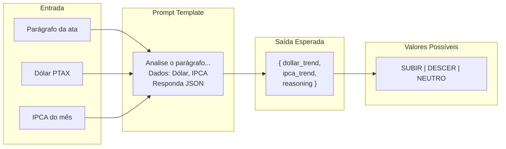

# Fluxograma do COPOM Crawler

## Visão Geral do Sistema

```mermaid
flowchart TB
    subgraph SCRAPE["Mode: SCRAPE"]
        S1[Navegar BCB website] --> S2[Extrair links das atas]
        S2 --> S3{Para cada ata}
        S3 --> S4[Fetch página da ata]
        S4 --> S5{Formato novo?}
        S5 -->|Sim| S6["Extrair div#atacompleta"]
        S5 -->|Não| S7["Fallback: buscar 'Sumário'"]
        S6 --> S8[Extrair data da URL]
        S7 --> S8
        S8 --> S9[Scrape USD-BRL Investing.com]
        S9 --> S10[Buscar IPCA do IBGE]
        S10 --> S11[Salvar em dataset_raw.json]
        S11 --> S3
    end

    subgraph ENRICH["Mode: ENRICH"]
        E1[Carregar dataset_raw.json] --> E2{Para cada ata}
        E2 --> E3{FalhaNoParse?}
        E3 -->|Sim| E4["Limpar HTML com regex"]
        E3 -->|Não| E5[Usar texto direto]
        E4 --> E6[Split por newline]
        E5 --> E6
        E6 --> E7["Agregar ~200 chars"]
        E7 --> E8{Para cada parágrafo}
        E8 --> E9{len >= 50?}
        E9 -->|Não| E8
        E9 -->|Sim| E10{Já processado?}
        E10 -->|Sim| E8
        E10 -->|Não| E11[Chamar Gemini API]
        E11 --> E12[Parse resposta JSON]
        E12 --> E13[Salvar EnrichedParagraph]
        E13 --> E14[Rate limit 2s]
        E14 --> E8
        E8 -->|Fim| E15[Salvar dataset_enriched.json]
        E15 --> E2
    end

    subgraph SERVE["Mode: SERVE"]
        V1[Carregar datasets] --> V2[Iniciar Gin server :8080]
        V2 --> V3["/atas - Lista atas"]
        V2 --> V4["/atas/:numero - Ata específica"]
        V2 --> V5["/enriched - Paginado"]
        V2 --> V6["/enriched/:id - Por ID"]
        V2 --> V7["/enriched/meeting/:n"]
        V2 --> V8["/swagger/* - Swagger UI"]
    end

    SCRAPE --> ENRICH
    ENRICH --> SERVE
```

## Fluxo de Dados

```mermaid
flowchart LR
    subgraph Fontes["Fontes de Dados"]
        BCB["BCB<br/>Atas COPOM"]
        INV["Investing.com<br/>USD-BRL"]
        IBGE["IBGE<br/>IPCA"]
    end

    subgraph Processamento
        SCR["Scraper<br/>Selenium"]
        ENR["Enricher<br/>Gemini AI"]
    end

    subgraph Storage["Armazenamento"]
        RAW["dataset_raw.json<br/>222 atas"]
        ENR_DATA["dataset_enriched.json<br/>270 parágrafos"]
    end

    subgraph API["REST API"]
        GIN["Gin Server<br/>:8080"]
        SWG["Swagger UI"]
    end

    BCB --> SCR
    INV --> SCR
    IBGE --> SCR
    SCR --> RAW
    RAW --> ENR
    ENR --> ENR_DATA
    RAW --> GIN
    ENR_DATA --> GIN
    GIN --> SWG
```

## Fluxo do Enricher (Detalhado)

```mermaid
flowchart TD
    A[dataset_raw.json] --> B[Carregar atas]
    B --> C{Próxima ata}
    C -->|Sim| D{FalhaNoParse?}
    D -->|Sim| E["Remove tags HTML<br/>regex: &lt;[^&gt;]*&gt;"]
    D -->|Não| F[Texto limpo]
    E --> G["Substitui &amp;nbsp; e &amp;amp;"]
    G --> H[Split por \\n]
    F --> H
    H --> I[Filtrar linhas vazias]
    I --> J[Buffer de agregação]
    J --> K{Buffer >= 200 chars?}
    K -->|Sim| L[Criar parágrafo]
    K -->|Não| M[Adicionar ao buffer]
    M --> J
    L --> N[Reset buffer]
    N --> J
    J -->|Fim linhas| O[Flush buffer restante]
    O --> P{Próximo parágrafo}
    P -->|Sim| Q{len >= 50?}
    Q -->|Não| P
    Q -->|Sim| R{Já processado?}
    R -->|Sim| P
    R -->|Não| S[callGeminiAPI]
    S --> T[Limpar markdown da resposta]
    T --> U[Parse JSON]
    U --> V[Criar EnrichedParagraph]
    V --> W[Salvar incrementalmente]
    W --> X[Sleep 2s]
    X --> P
    P -->|Fim| C
    C -->|Fim| Y[dataset_enriched.json]
```

## Estrutura do Prompt Gemini

```mermaid
flowchart LR
    subgraph Input["Entrada"]
        P["Parágrafo da ata"]
        D["Dólar PTAX"]
        I["IPCA do mês"]
    end

    subgraph Prompt["Prompt Template"]
        T["Analise o parágrafo...<br/>Dados: Dólar, IPCA<br/>Responda JSON"]
    end

    subgraph Output["Saída Esperada"]
        J["{ dollar_trend,<br/>ipca_trend,<br/>reasoning }"]
    end

    subgraph Trends["Valores Possíveis"]
        TR["SUBIR | DESCER | NEUTRO"]
    end

    P --> T
    D --> T
    I --> T
    T --> J
    J --> TR
```
